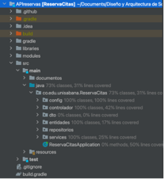

Desarrollado por: Sebastián Castellanos & Sara Piraquive
# APIreservas

## 1. Introducción
Este documento proporciona una descripción detallada de la arquitectura de software de la solución "Reserva de Citas", incluyendo los requerimientos funcionales y no funcionales, el estilo de arquitectura utilizado, los patrones arquitectónicos implementados, y los diagramas de componentes y paquetes.

Este proyecto implementa un API REST para que los usuarios puedan acceder y modificar información de reserva de citas. Se definen controladores RESTful utilizando las anotaciones de Spring, permitiendo consultar y manipular datos a través de Postman con las URIs correspondientes.

En primer lugar, se debe establecer la conexión teniendo en cuenta el puerto determinado, al establecer la conexión, se puede consultar y gestionar datos operaciones CRUD (Crear, Leer, Actualizar, Eliminar) utilizando los métodos HTTP estándar (GET, POST, PUT, DELETE) en Postman. 

## 2. Requerimientos funcionales y no funcionales

La API proporciona los siguientes requerimientos; dentro de los funcionales se encuentra que los usuarios puedan registrar clientes, estilistas y servicios en el sistema, una vez estén registrados al menos uno de cada uno, se pueden programar citas con estilistas disponibles, también se podrán cancelar o reprogramar.
En cuanto a los requerimientos no funcionales está la seguridad, en donde el sistema debe implementar autenticación y autorización para proteger los datos de los usuarios; y el rendimiento, se debe estar en la capacidad de manejar un alto volumen de solicitudes de manera eficiente.

Estos requerimientos son esenciales para proporcionar las funcionalidades básicas de reserva de citas, lo logramos siguiendo una arquitectura basada en microservicios, de igual forma, se implementaron patrones arquitectónicos como MVC (Modelo-Vista-Controlador) para separar la lógica de negocios, la presentación y el control de la lógica de negocio (modelo, vista, controlador).

Inyección de dependencias para facilitar la configuración y la gestión de dependencias en los componentes del sistema.

## 3.	Tests

Para asegurar el correcto funcionamiento de la API, se desarrolló una serie de pruebas para garantizar la calidad y confiabilidad del código.

•	Pruebas unitarias sobre la lógica (service), con el objetivo de validar el comportamiento individual de cada unidad de código.

•	Pruebas de integración (controladores), para verificar la correcta interacción entre diferentes unidades de código.

•	Pruebas de mutación para evaluar la robustez del código frente a pequeños cambios en su estructura.

Para las mutation test se empleó pitest (PIT MUTATION TESTING). Una vez configurado el plugin y las opciones, se ejecuta PIT con el siguiente comando de Gradle:

./gradlew pitest

Después de la ejecución, los reportes de PIT se encuentran en el directorio build/reports/pitest. Al abrir el archivo index.html en un navegador web se pueden ver los resultados detallados.

## 4.	Funciones específicas de la API

•	Configurar la franja de trabajo en la que se podrán hacer reservas: en el caso de la franja horario se trabajó en un condicional el cual no permitiese agendar antes de las 9am y después de las 19 horas, de lo contrario nos mandaría un mensaje de alerta

•	Consulta de Disponibilidad: al seleccionar una fecha y hora, se consulta al backend para obtener todas las citas existentes. Si la fecha seleccionada está entre las fechas reservadas, se muestra como "reservada"; de lo contrario, se muestra como "disponible". Se utiliza estado local para gestionar la fecha seleccionada, las citas obtenidas y el estado de carga. El estilo se maneja con CSS en línea para estructurar la página y resaltar la disponibilidad.

•	En la página de reserva de citas, los valores para clientes, estilistas y servicios son esenciales para que los usuarios puedan realizar una reserva adecuada. Estos valores se obtienen del backend, lo que significa que provienen de un servidor remoto que almacena y proporciona los datos necesarios para la aplicación.Para lograr esto, se utiliza una técnica comúnmente conocida como "llamadas a la API" o "solicitudes HTTP GET". Cuando un usuario accede a la página de reserva de citas, la aplicación realiza solicitudes GET al backend para obtener la lista de clientes, estilistas y servicios disponibles. Una vez que se reciben los datos del backend, la aplicación los utiliza para poblar los elementos desplegables en el formulario de reserva.
Esta integración con el backend es fundamental para garantizar que la aplicación pueda mostrar información actualizada y precisa, así como proporcionar una experiencia fluida y sin interrupciones para los usuarios que desean reservar una cita

•	Para habilitar la cancelación de citas, se implementó una solicitud HTTP DELETE al backend. Cuando un usuario solicita cancelar una cita, se activa una función que envía esta solicitud, incluyendo el identificador único de la cita a cancelar. El servidor procesa esta solicitud, eliminando la cita correspondiente de la base de datos. Una vez confirmada la cancelación, la interfaz de usuario se actualiza automáticamente para reflejar el cambio, eliminando la cita cancelada de la lista mostrada al cliente.

## 5.	C4

**Model system context diagram**

**Container diagram**

## 6.	Responsabilidad ética
Las responsabilidades éticas y profesionales deben considerarse al utilizar el sistema en diferentes contextos. En todos, es crucial proteger la privacidad y seguridad de los datos de los clientes, pacientes o usuarios. Esto implica implementar medidas de seguridad robustas para proteger la información personal y médica sensible, así como cumplir con las regulaciones de protección de datos. Por otra parte, los profesionales que utilizan el sistema deben ser responsables de los resultados de su uso. Esto implica tomar decisiones éticas y profesionales basadas en el mejor interés del cliente, paciente o usuario, y asumir la responsabilidad por cualquier resultado adverso que pueda surgir del uso del sistema.

